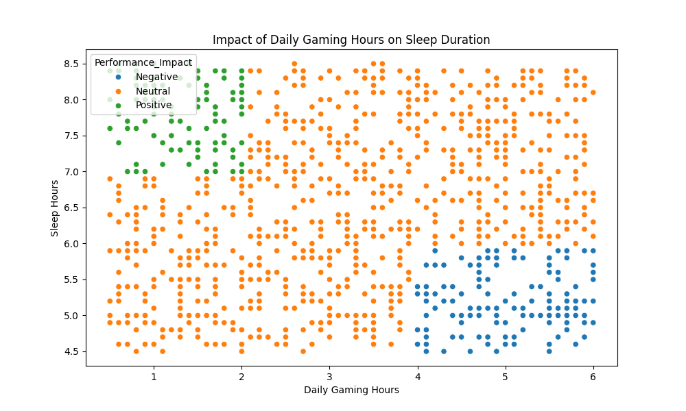

# Gaming Habits & Performance Analysis 🎮📊

An end-to-end Data Cleaning and Exploratory Data Analysis (EDA) project using Python.

## Project Overview
This project analyzes how daily gaming hours impact an individual's sleep, stress levels, and overall academic/work performance based on a dataset of 1,000 users.

## Steps Performed
1. *Data Cleaning:* Identified and fixed anomalies in the Focus_Level column where non-numeric values like 'U0001' were present.
2. *Exploratory Data Analysis (EDA):* Explored the relationship between gaming duration, sleep deprivation, and high stress.
3. *Data Visualization:* Generated scatter plots (gaming_vs_sleep.png) showing trends between daily gaming and sleep hours.

## Tech Stack Used
* Python (Pandas, Matplotlib, Seaborn)
* Microsoft Excel

## Output Visualization

